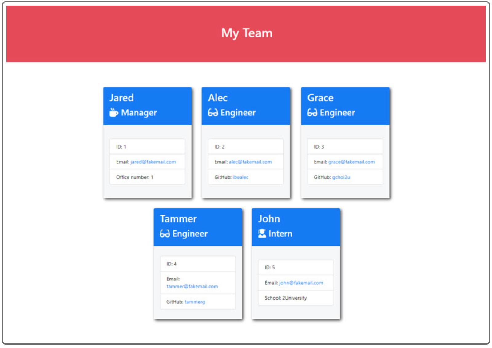

# profileGen
A profile generator for employees which deplys into a HTML page. 

## Description 📜
When running a business a Manager wants to generate a webpage that displays their team's basic information so that they have quick access to their team's emails and GitHub profiles.

## Motivation 💪🏻
This project was created to use command line prompts via Node.js so that the information could be used to create a profile generator.
This would allow the Manager to have a quick way of compiling all the details together and generating a HTML page withe required data.

## Build status 🏗
* No starter code provied for this project. The code has been built by Adela Kobic

## Code style 🔐
* Standard HTML and CSS has been used for this project. 
The language for the website is written in US English. (USA English)

## Acceptance Criteria ✅
GIVEN a command-line application that accepts user input
* WHEN I am prompted for my team members and their information
THEN an HTML file is generated that displays a nicely formatted team roster based on user input
* WHEN I click on an email address in the HTML
THEN my default email program opens and populates the TO field of the email with the address
* WHEN I click on the GitHub username
THEN that GitHub profile opens in a new tab
* WHEN I start the application
THEN I am prompted to enter the team manager’s name, employee ID, email address, and office number
* WHEN I enter the team manager’s name, employee ID, email address, and office number
THEN I am presented with a menu with the option to add an engineer or an intern or to finish building my team
* WHEN I select the engineer option
THEN I am prompted to enter the engineer’s name, ID, email, and GitHub username, and I am taken back to the menu
* WHEN I select the intern option
THEN I am prompted to enter the intern’s name, ID, email, and school, and I am taken back to the menu
* WHEN I decide to finish building my team
THEN I exit the application, and the HTML is generated

## Assets 📷
Preview of how the generator should look like

Actual generated HTML example:

## Problems encountered 🤯
* geting 

## Changes made to the code 𝌡
* Folders and base files created
* Classes created for Employee (parent file) then linked to Intern, Engineer and Manager files
* Begining to write the tests for Employee, Intern, Engineer and Manager 4/9/22

## Link to the deployed website 💻
No delpoyed website for this assignment sample HTML file generated will be available as part of the submission

## Video link
Video link for this project.

## Credits 💃🏻
* Picture credits as follows: 
    * Pikisuperstar. (2022, July 6) Freepik.com. <a href="https://www.freepik.com/vectors/abstract-mountain">Abstract mountain vector created by pikisuperstar - www.freepik.com</a>
    (mountain picture) 

## Licence 🪪
* MIT Liscence has been chosen for this project